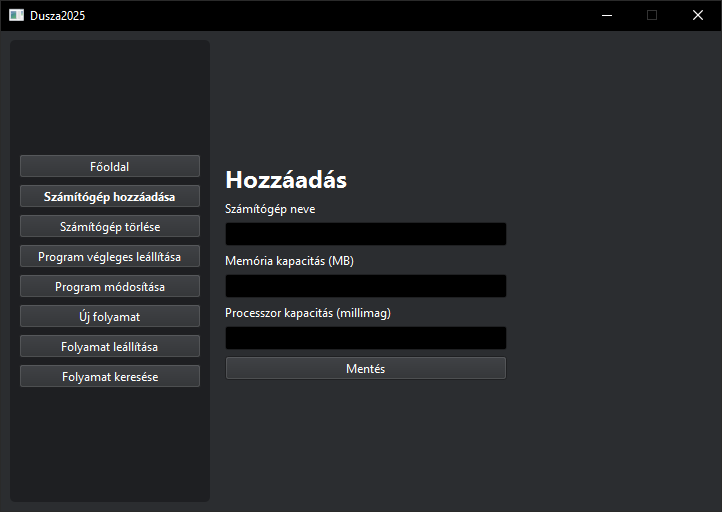
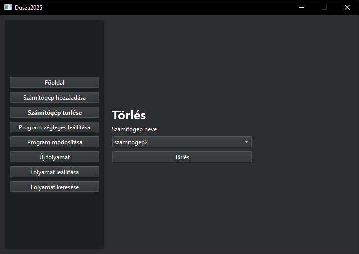

# Számítógép kezelés

## Számítógép hozzáadása

A klaszterhez új számítógép hozzáadásához kövesse az alábbi lépéseket:

1. Kattintson a "Számítógép hozzáadása" gombra a bal oldali menüben
2. Adja meg a számítógép adatait:
   - Név
   - IP cím vagy hálózati azonosító
   - Egyéb szükséges konfigurációs paraméterek
3. Kattintson a "Mentés" gombra

### Fontos tudnivalók

- A számítógép nevének egyedinek kell lennie

## Számítógép törlése

Meglévő számítógép eltávolításához:

1. Válassza a "Számítógép törlése" opciót
2. A listából válassza ki a törölni kívánt számítógépet
3. Kattintson a "Törlés" gombra

### Figyelmeztetések

- A törlés előtt állítsa le az összes futó folyamatot
- A törlés végleges művelet
- A törölt számítógép újbóli hozzáadása lehetséges

## Hibaelhárítás

### Gyakori problémák

1. **Duplikált név**
   - Válasszon másik nevet
   - Ellenőrizze a meglévő gépek listáját

2. **Jogosultsági problémák**
   - Ellenőrizze a felhasználói jogosultságokat
   - Szükség esetén kérjen adminisztrátori hozzáférést 