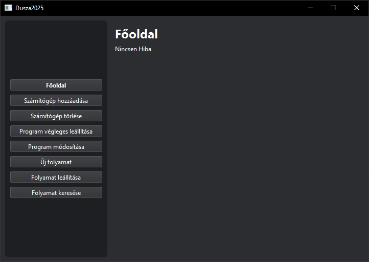

# Első lépések

## Program indítása

A Dusza2025 rendszer első indításakor néhány egyszerű lépést kell követni:

1. Indítsa el a `main.exe` fájlt
2. A megjelenő ablakban válassza ki a klaszter mappát
3. A sikeres indítás után megjelenik a főablak

## A felhasználói felület áttekintése

### Főablak felépítése

A program főablaka két fő részből áll:

- **Bal oldali navigációs sáv**: Gyors hozzáférés a fő funkciókhoz
- **Jobb oldali tartalom terület**: Az aktuálisan kiválasztott funkció kezelőfelülete

### Navigációs menü elemei

- **Főoldal**: Rendszer áttekintés és állapot
- **Számítógép kezelés**:
  - Számítógép hozzáadása
  - Számítógép törlése
- **Program kezelés**:
  - Program végleges leállítása
  - Program módosítása
  - Új folyamat
- **Folyamat kezelés**:
  - Folyamat leállítása
  - Folyamat keresése

## Első lépések

1. A program első használatakor a **Főoldal** fog megjelenni
2. Új számítógép hozzáadásához használja a "Számítógép hozzáadása" funkciót
3. Programok hozzáadásához válassza az "Új folyamat" opciót

## Hibaelhárítás

Ha a program indításakor hibaüzenet jelenik meg:

- Ellenőrizze, hogy a kiválasztott klaszter mappa létezik és elérhető
- Győződjön meg róla, hogy rendelkezik megfelelő jogosultságokkal