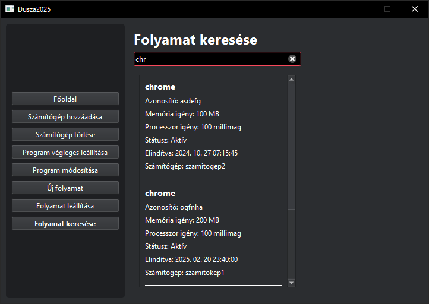
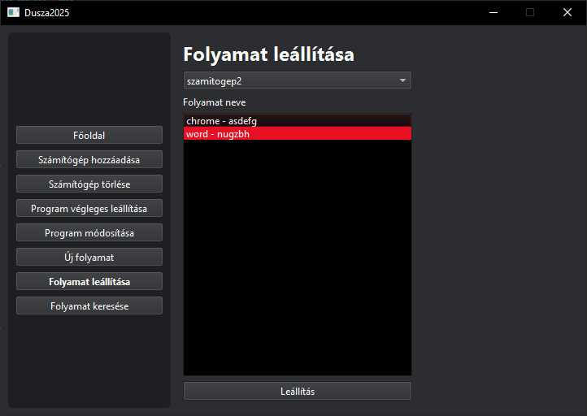

# Folyamat kezelés

## Folyamat keresése

1. Gépelje be a keresendő program nevét. (a lista valós időben frissül)

## Folyamat leállítása

2. Kattintson a "Folyamat leállítása" menüpontra
2. Válasszon a számítógépek listájából
3. Válassza ki a leállítandó folyamatot/folyamatokat
4. Kattintson a "Leállítás" gombra (ez a művelet nem visszavonható!)

