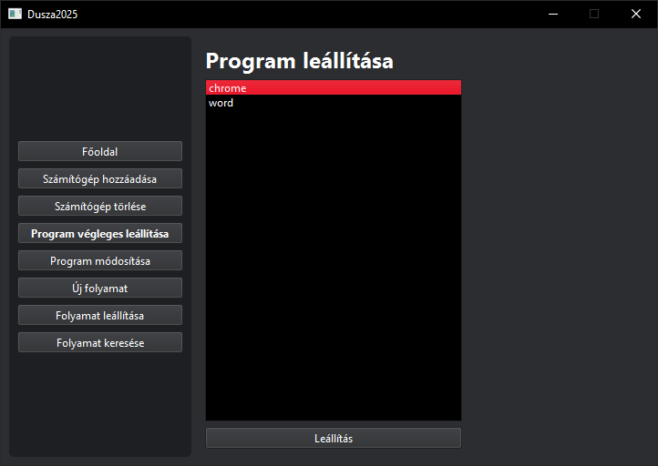

# Program kezelés

## Új folyamat indítása

Program futtatásához kövesse az alábbi lépéseket:

1. Kattintson az "Új folyamat" gombra
2. Válassza ki a célszámítógépet
3. Válassza ki az indítandó programot
4. Kattintson az "Indítás" gombra

## Program módosítása

Futó program paramétereinek módosításához:

1. Válassza a "Program módosítása" opciót
2. Válassza ki a módosítandó programot
3. Végezze el a szükséges módosításokat:
   - Futtatandó példányok
   - Processzorigény
   - Memóriaigény
4. Kattintson a "Mentés" gombra

## Program leállítása

Program végleges leállításához:

1. Kattintson a "Program végleges leállítása" menüpontra
2. Válassza ki a leállítandó programot/programokat
3. Kattintson a "Leállítás" gombra

### Figyelmeztetések

- A program leállítása minden kapcsolódó folyamatot megszüntet
- A művelet nem visszavonható
